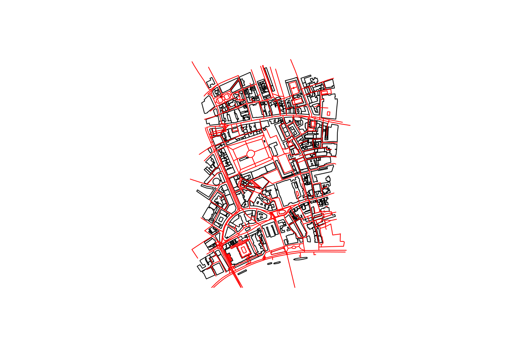

<!-- README.md is generated from README.Rmd. Please edit that file -->

```{r opts, echo = FALSE}
knitr::opts_chunk$set(
  collapse = TRUE,
  warning = TRUE,
  message = TRUE,
  width = 120,
  comment = "#>",
  fig.retina = 2,
  fig.path = "README-"
)
```


[](https://travis-ci.org/osmdatar/osmdata) 
[](https://ci.appveyor.com/project/mpadge/osmdata)
[](https://codecov.io/gh/osmdatar/osmdata)
[](http://www.repostatus.org/#wip)
[](http://cran.r-project.org/web/packages/osmdata) 


`osmdata` is an R package for accessing OpenStreetMap (OSM) data using the
[Overpass API](http://wiki.openstreetmap.org/wiki/Overpass_API).  The Overpass
API (or OSM3S) is a read-only API that serves up custom selected
parts of the OSM map data. Map data are returned as
[`sp`](https://cran.r-project.org/package=sp) objects.


### Installation

```{r install, eval=FALSE}
devtools::install_github("osmdatar/osmdata")
```

```{r usage2, echo=FALSE}
#devtools::load_all (".")
devtools::load_all (".", export_all=FALSE)
#devtools::load_all (".", recompile=TRUE)
#devtools::document (".")
#goodpractice::gp (".")
#devtools::check (".")
#testthat::test_package ("osmdata")
#Rcpp::compileAttributes()
```
```{r cachegrind, echo=FALSE, eval=FALSE}
R -d "valgrind --tool=callgrind" -f test.R
kcachegrind callgrind.out.<pid>
```

Current verison:

```{r}
library(osmdata)
packageVersion("osmdata")
```

### Usage

[Overpass API](http://wiki.openstreetmap.org/wiki/Overpass_API) queries can be
built from a base query constructed with `opq` followed by `add_feature`. The
corresponding OSM objects are then downloaded and converted to `sf` objects with
`osmdata_sf` or to `sp` objects with `osmdata_sp`. For example,

```{r query-thames}
q0 <- opq (bbox=c(-0.27,51.47,-0.20,51.50)) # Chiswick Eyot in London, U.K.
q1 <- add_feature (q0, key='name', value="Thames", exact=FALSE)
x <- osmdata_sf (q1)
x
```

```{r query1}
q0 <- opq (bbox=c(-0.12,51.51,-0.11,51.52)) # Central London, U.K.
q1 <- add_feature (q0, key='building')
bu <- osmdata_sp (q1)
bu
```

or,

```{r query2}
q2 <- add_feature (q0, key='highway')
hs <- osmdata_sp (q2)
hs
```

Plotting with `sp`:
```{r plot1, eval=FALSE}
sp::plot (bu$osm_polygons)
lines (hs$osm_lines, col="red")
```


```{r london-motorways, eval=FALSE}
q0 <- opq (bbox=getbb ("London, UK"))
q1 <- add_feature (q0, key="highway", value="motorway")
lon <- osmdata_sp (q1, quiet=TRUE)
sp::plot (lon$osm_lines)
```


OSM data can also be downloaded in OSM XML format with `osmdata_xml` and saved
for use with other software.
```{r query3, eval=FALSE}
osmdata_xml (q1, "data.xml")
```
The `XML` document is returned silently and can be passed directly to
`osmdata_sp` or `osmdata_sf`
```{r query4, eval=FALSE}
doc <- osmdata_xml (q1, "data.xml")
x <- osmdata_sf (q1, doc)
```
Or data can be read from a previously downloaded file:
```{r query5, eval=FALSE}
x <- osmdata_sf (q1, "data.xml")
```


The [Overpass API](http://wiki.openstreetmap.org/wiki/Overpass_API) provides
access to OSM elements selected by search criteria such as location, types of
objects, tag properties, proximity, or combinations of these.

To explore simple Overpass queries interactively, try 
[overpass turbo](http://overpass-turbo.eu/), and to find out more about building
queries see the 
[Language Guide](http://wiki.openstreetmap.org/wiki/Overpass_API/Language_Guide)
or the more comprehensive
[Language Reference](http://wiki.openstreetmap.org/wiki/Overpass_API/Overpass_QL).

<!--
The following functions are implemented:

- `add_feature`:	Add a feature to an Overpass query
- `available_features`:	List recognized features in OSM Overpass
- `available_tags`:	List tags associated with a feature
- `bbox_to_string`:	Convert a named matrix or a named vector (or an unnamed vector) return a string
- `opq`:	Begin building an Overpass query
- `overpass_query`:	Issue OSM Overpass Query
- `overpass_status`:	Retrieve status of the Overpass API
- `read_osm`:	Read an XML OSM Overpass response from path
-->


### Test Results

```{r test}
date()

testthat::test_dir("tests/")
```

### Code of Conduct

Please note that this project is released with a [Contributor Code of Conduct](CONDUCT.md). 
By participating in this project you agree to abide by its terms.
