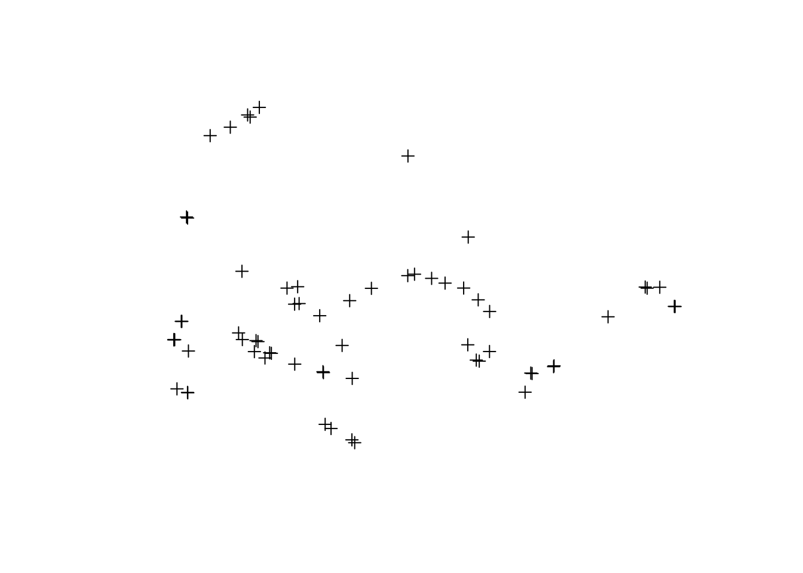
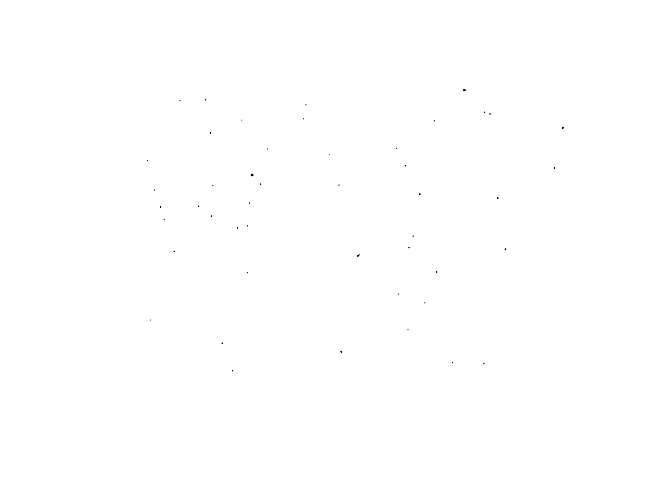
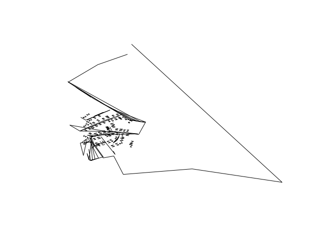

<!-- README.md is generated from README.Rmd. Please edit that file -->
[](https://travis-ci.org/hrbrmstr/overpass) ](<http://www.repostatus.org/#concept>) [](http://cran.r-project.org/web/packages/overpass) 

overpass is a packge with tools to work with the OpenStreetMap (OSM) [Overpass API](http://wiki.openstreetmap.org/wiki/Overpass_API)

The following functions are implemented:

-   `overpass_query`: Issue OSM Overpass Query

### News

-   Version 0.0.0.9000 released

### Installation

``` r
devtools::install_github("hrbrmstr/overpass")
```

### Usage

``` r
library(overpass)
library(sp)

# current verison
packageVersion("overpass")
#> [1] '0.0.0.9000'

# just nodes
only_nodes <- '[out:xml];
node
  ["highway"="bus_stop"]
  ["shelter"]
  ["shelter"!~"no"]
  (50.7,7.1,50.8,7.25);
out body;'

pts <- overpass_query(only_nodes)
plot(pts)
```



``` r

# ways & nodes
nodes_and_ways <- '[out:xml];
(node["amenity"="fire_station"]
    (50.6,7.0,50.8,7.3);
  way["amenity"="fire_station"]
    (50.6,7.0,50.8,7.3);
  rel["amenity"="fire_station"]
    (50.6,7.0,50.8,7.3););
(._;>;);
out;'

wys <- overpass_query(nodes_and_ways)
plot(wys)
```



``` r

# xml version of the query
actual_ways <- '<osm-script output="xml">
  <query type="way">
    <bbox-query e="7.157" n="50.748" s="50.746" w="7.154"/>
  </query>
  <union>
    <item/>
    <recurse type="down"/>
  </union>
  <print/>
</osm-script>'

awy <- overpass_query(actual_ways)
plot(awy)
```



### Test Results

``` r
library(overpass)
library(testthat)

date()
#> [1] "Mon Aug 10 11:19:39 2015"

test_dir("tests/")
#> testthat results ========================================================================================================
#> OK: 0 SKIPPED: 0 FAILED: 0
#> 
#> DONE
```

### Code of Conduct

Please note that this project is released with a [Contributor Code of Conduct](CONDUCT.md). By participating in this project you agree to abide by its terms.
