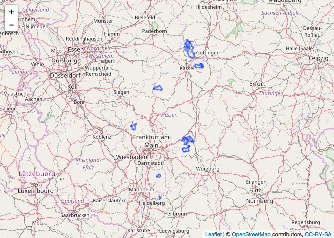

`overpass`: Tools to Work With the OpenStreetMap (OSM) Overpass API

The Overpass API (or OSM3S) is a read-only API that serves up custom selected parts of the OSM map data. It acts as a database over the web: the client sends a query to the API and gets back the data set that corresponds to the query.

Unlike the main API, which is optimized for editing, Overpass API is optimized for data consumers that need a few elements within a glimpse or up to roughly 100 million elements in some minutes, both selected by search criteria like e.g. location, type of objects, tag properties, proximity, or combinations of them. It acts as a database backend for various services.

Overpass API has a powerful query language (language guide, language reference, an IDE) beyond XAPI, but also has a compatibility layer to allow a smooth transition from XAPI.

### API

-   `add_feature`: Add a feature to an Overpass query
-   `available_features`: List recognized features in OSM Overpass
-   `available_tags`: List tags associated with a feature
-   `issue_query`: Finalize and issue an Overpass query
-   `opq`: Begin building an Overpass query
-   `overpass_query`: Issue OSM Overpass Query
-   `overpass_status`: Retrieve status of the Overpass API
-   `read_osm`: Read an XML OSM Overpass response from path

``` r
library(overpass)
```

    ## Data (c) OpenStreetMap contributors, ODbL 1.0. http://www.openstreetmap.org/copyright

``` r
library(sp)
library(htmltools)
library(leaflet)
```

### Find all cinemas in Bonn which are at most 100m away from bus stops

``` r
bonn_bus_stops <- '[out:xml];
area[name="Bonn"];
node(area)[highway=bus_stop];
node(around:100)[amenity=cinema];
out;'

bss <- overpass_query(bonn_bus_stops)
```

    ## Issuing query to OSM Overpass...

    ## 2 slots available now.

    ## Query complete!

``` r
leaflet(bss) %>% 
  addTiles() %>% 
  addCircles(radius=50,
             popup=sprintf("<b><a target='_blank' href='%s'>%s</a></b>%s<br/><hr noshade size='1'/>%s %s<br/>%s</b>",
                           htmlEscape(bss@data$website),
                           htmlEscape(bss@data$name),
                           ifelse(tolower(bss@data$wheelchair) %in% c("yes", "limited"), 
                                  "<span style='text-align:right'> [H]</span>", ""),
                           htmlEscape(bss@data$addr.housenumber),
                           htmlEscape(bss@data$addr.street),
                           htmlEscape(bss@data$addr.city)))
```


### Find all counties in Hessen without fire station

``` r
hessen_fire <- '[out:xml];
area[admin_level=4]["name"="Hessen"][boundary=administrative]->.boundaryarea;
 
( node(area.boundaryarea)["amenity"="fire_station"];
  way(area.boundaryarea)["amenity"="fire_station"];>;) ->.a;
 
.a is_in -> .b; 
area.b[admin_level=8] -> .bf; 
 
rel(area.boundaryarea)[admin_level=8];
map_to_area -> .bllf;
 
(.bllf - .bf ) ; 
rel(pivot); (._;>;); out;'
```

``` r
hfr <- overpass_query(hessen_fire)
```

    ## Issuing query to OSM Overpass...

    ## 1 slots available now.

    ## Query complete!

``` r
lf <- leaflet(hfr) %>% addTiles()
for (i in 1:length(hfr@lines)) {
  lf <- lf %>% addPolylines(data=hfr@lines[[i]], weight = 3) 
}
lf
```


